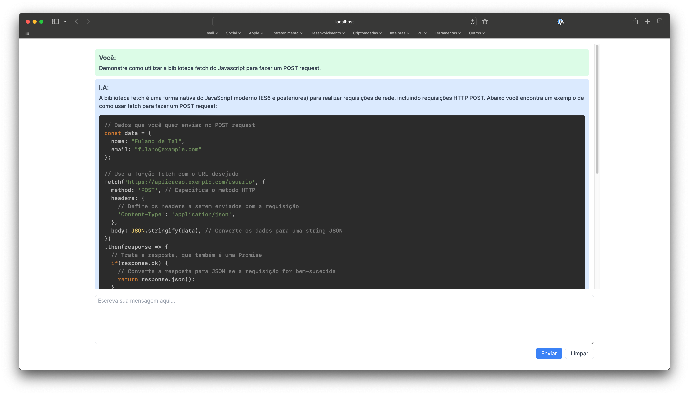

An alternative for ChatGPT Plus using the GPT 4 latest model to simulate a conversation - just like ChatGPT Plus does. The idea is to have access to the GPT 4 model without having to pay monthly for the ChatGPT Plus subscription. Be aware, however, that you still pay to use their API [GPT API Pricing](https://openai.com/pricing).

## Getting Started

First, add your OPENAI_API_KEY in the .env file. Then, run the development server:

```bash
npm run dev
```

Open [http://localhost:3000](http://localhost:3000) with your browser to see the result.

